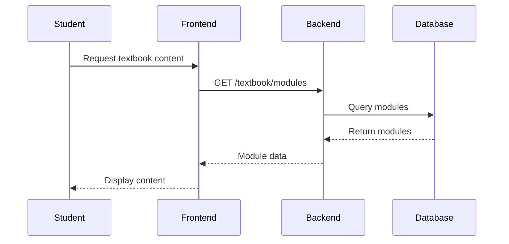
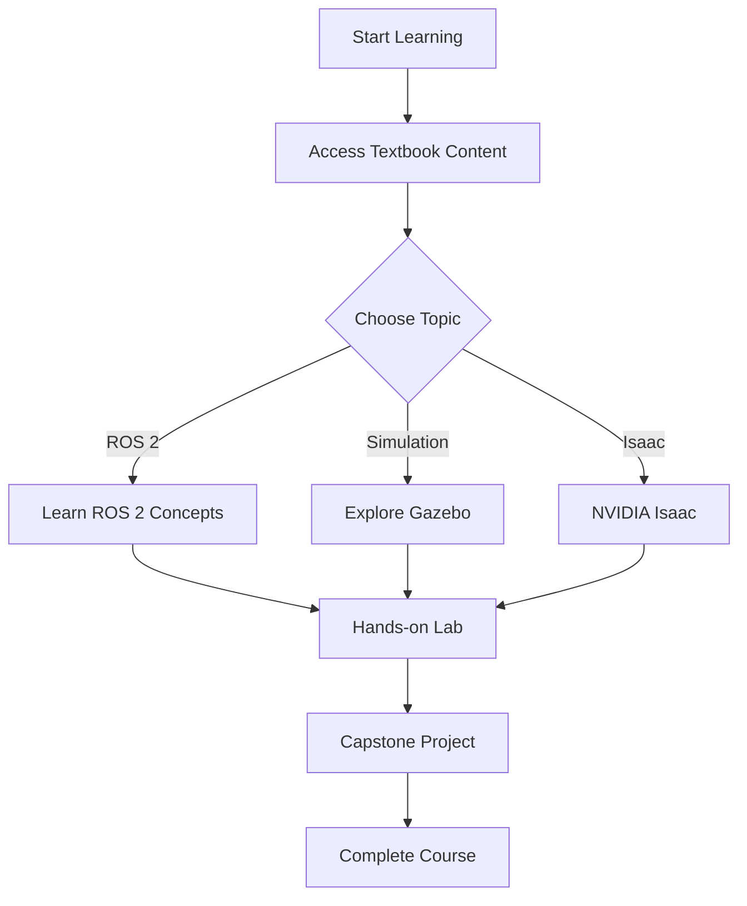
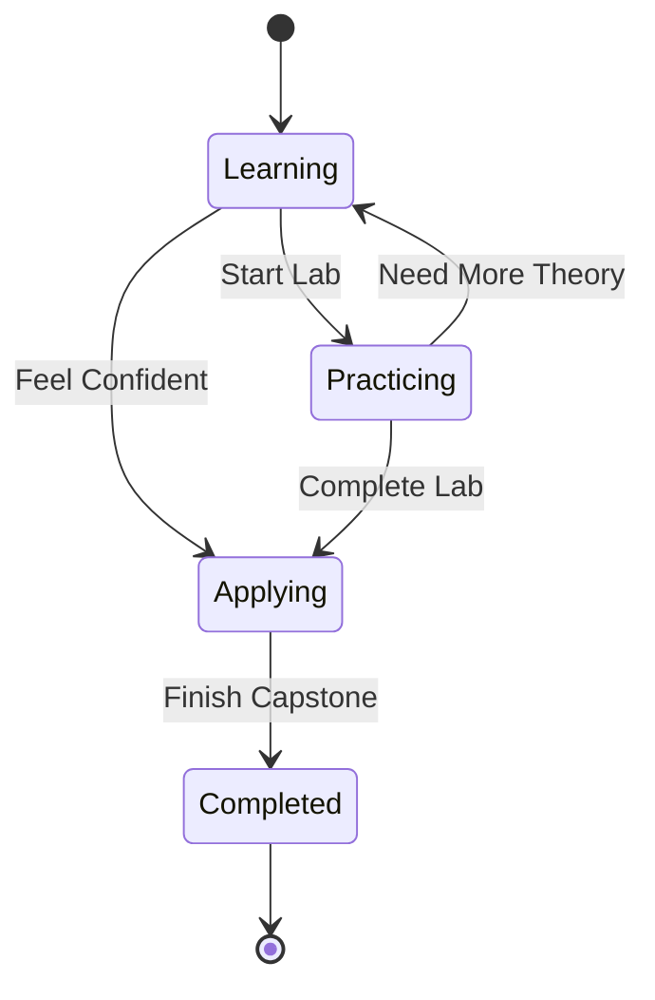

# Mermaid Diagram Example

This page demonstrates how to use Mermaid diagrams in the AI-Native Textbook.

## Sequence Diagram



## Flowchart



## Class Diagram

```mermaid
classDiagram
    class TextbookModule {
        +String id
        +String title
        +String slug
        +String content
        +String category
        +List~String~ prerequisites
        +List~String~ learningObjectives
        +Integer estimatedDuration
        +Boolean isPublished
    }

    class LearningResource {
        +String id
        +String title
        +String resourceType
        +String content
        +String filePath
        +UUID moduleId
        +Boolean isPublished
    }

    TextbookModule ||--o{ LearningResource : contains
```

## State Diagram



Mermaid diagrams provide an excellent way to visualize complex concepts in robotics and AI, making the learning experience more engaging and comprehensible.